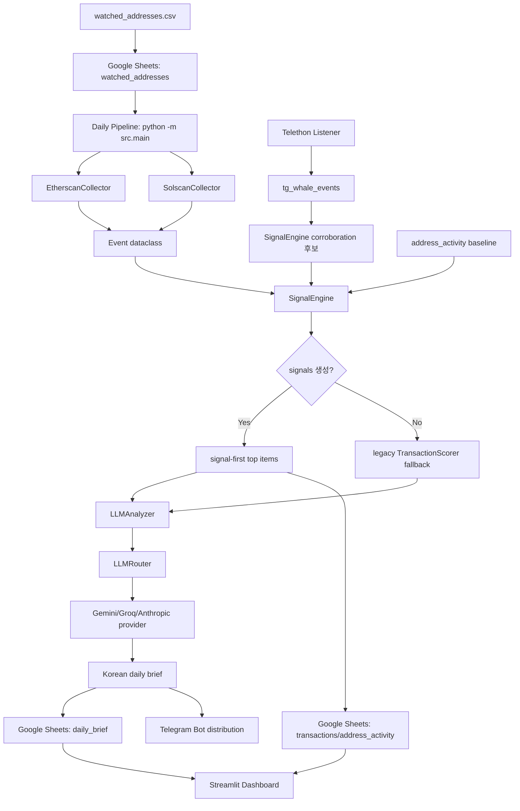

# WhaleScope 개선 적용 및 실행 아키텍처 보고서

## 1. 요약

WhaleScope는 뤼튼테크놀로지스 Product Engineer 과제 전형용 프로젝트이며, 선택 도메인은 `C. AI 요약/큐레이션 서비스`다.

현재 구현은 "고래 이벤트를 많이 보여주는 서비스"가 아니라, 온체인/Telegram 이벤트를 수집한 뒤 규칙 기반 시그널로 중요한 이벤트를 먼저 고르고, LLM이 한국어 브리핑으로 요약하는 큐레이션 서비스 구조다.

이번 개선에서는 과제 제출 관점에서 다음을 정상화했다.

- README와 One Pager를 과제 맥락에 맞게 정리했다.
- Claude API 키가 없어도 Gemini/Groq fallback으로 실제 LLM 데모가 가능하도록 수정했다.
- signal-first 파이프라인, address activity 저장, analysis log 확장, Telegram 개인화 경로를 보강했다.
- Google Sheets 초기화/감시 주소 적재/외부 연결/대시보드 실행까지 실제 환경 검증을 완료했다.
- `main` 브랜치에 병합 및 push 완료했다.

현재 대시보드가 비어 보이는 것은 UI 오류가 아니다. Google Sheets 기준으로 감시 주소는 들어갔지만, 실제 거래 수집/브리핑 파이프라인을 운영 모드로 아직 실행하지 않아 `transactions`, `daily_brief`, `signals`, `address_activity` 탭이 비어 있기 때문이다.

## 2. 현재 데이터 상태

2026-04-15 확인 기준 Google Sheets 주요 탭 상태:

| 탭 | 데이터 행 수 | 의미 |
|---|---:|---|
| `watched_addresses` | 80 | 감시 주소 시드 적재 완료 |
| `transactions` | 0 | 실제 온체인 수집 결과 없음 |
| `address_activity` | 0 | 감시 주소별 활동 로그 없음 |
| `signals` | 0 | 생성/저장된 시그널 없음 |
| `daily_brief` | 0 | 저장된 일일 브리핑 없음 |

대시보드는 Google Sheets의 `transactions`와 `daily_brief`를 읽어서 표시한다. 따라서 현재는 대시보드가 정상 실행되어도 "No daily briefs available yet", "No transactions found"가 표시되는 것이 맞다.

데이터가 생기는 조건:

- `python -m scripts.init_sheets`로 탭 생성
- `python scripts/import_watched_addresses.py`로 감시 주소 적재
- `python -m src.main` 실제 실행
- 최근 24시간 내 감시 주소 활동이 수집되어야 함
- 수집 이벤트가 있으면 `address_activity`, `transactions`, `daily_brief`, `system_log`가 채워짐
- 시그널이 생성되면 브리핑의 top transaction payload에 signal metadata가 반영됨

주의할 점은 `scripts/test_connection.py`, `scripts/smoke_pipeline.py`, `scripts/demo_real_llm.py`는 연결/데모 검증용이지 운영 데이터 적재용이 아니라는 점이다.

## 3. 개선 적용 내역

### 3-1. 과제 제출 패키징

변경 파일:

- `README.md`
- `docs/one-pager.md`
- `docs/demo-output.md`

적용 내용:

- 뤼튼 과제 전형임을 README 상단에 명시했다.
- 선택 도메인을 `C. AI 요약/큐레이션 서비스`로 고정했다.
- Real LLM demo를 기본 데모 경로로 설명했다.
- smoke test는 fallback 검증 경로로 낮췄다.
- env, Google Sheets, Telegram, Streamlit 실행법을 상세화했다.

의미:

- 평가자가 repo만 보고 문제 정의, AI 활용 방식, 실행 순서, 현재 한계를 이해할 수 있게 정리했다.
- 데모가 단순 mock이 아니라 실제 LLM API를 통과한다는 점을 보여준다.

### 3-2. Claude 없이도 동작하는 LLM fallback

변경 파일:

- `src/config.py`
- `src/llm/router.py`
- `config/llm_routing.yaml`
- `scripts/test_connection.py`
- `tests/test_config.py`
- `tests/test_llm_router.py`

적용 내용:

- 기존에는 `ANTHROPIC_API_KEY`가 없으면 config load 단계에서 실패했다.
- 지금은 `ANTHROPIC_API_KEY`, `GEMINI_API_KEY`, `GROQ_API_KEY` 중 최소 1개만 있으면 실행 가능하다.
- preferred provider에 키가 없으면 router가 즉시 실패하지 않고 fallback provider를 시도한다.
- Gemini 모델명을 최신 설정 경로인 `gemini-2.5-flash`로 맞췄다.
- 연결 테스트도 설정된 LLM provider만 검사하도록 바꿨다.

검증 결과:

- Gemini PASS
- Groq PASS
- Anthropic 키 없음이어도 전체 연결 테스트 PASS

남은 이슈:

- `gemini-2.5-flash` 비용 테이블이 아직 `src/llm/usage.py`에 없어 cost가 `0.0`으로 기록된다는 warning이 있다. 기능 장애는 아니지만 비용 추적 정확도를 위해 후속 보완이 필요하다.

### 3-3. Signal-first 일일 파이프라인 강화

변경 파일:

- `src/main.py`
- `tests/test_main.py`

적용 내용:

- 수집 이벤트를 `SignalEngine`에 먼저 통과시키고, 시그널이 있으면 legacy transaction scoring 경로를 건너뛴다.
- 감시 주소 활동을 `address_activity` 탭에 저장한다.
- signal 기반 top item에 `signal_id`, `rule`, `severity`, `source`, `evidence_count`, `window_start`, `window_end` 등 메타데이터를 포함한다.
- Telegram/LLM 기반 이벤트처럼 tx hash가 없거나 `amount_usd`가 unknown인 경우에도 브리핑 저장이 깨지지 않도록 `amount_usd_known`을 추가했다.
- `total_volume_usd` 계산에서 `None` 금액을 안전하게 처리한다.

의미:

- LLM은 탐지기가 아니라 설명기로 사용된다.
- 핵심 판단은 규칙 기반 signal layer가 담당한다.
- AI 출력 품질이 흔들려도 수집/탐지/저장 경로는 안정적으로 유지된다.

### 3-4. Google Sheets 스키마와 초기 적재 안정화

변경 파일:

- `src/storage/schema.py`
- `src/storage/sheets_client.py`
- `scripts/import_watched_addresses.py`
- `tests/test_storage.py`
- `tests/test_storage_new_tabs.py`

적용 내용:

- `analysis_log`에 `task`, `prompt_version`, `model_id`, `tokens_in`, `tokens_out`, `cost_usd`, `latency_ms`를 추가했다.
- `watched_addresses`, `address_activity`, `tg_whale_events`, `signals`, `weekly_trend`, `user_interests` 탭을 초기화 경로에 포함했다.
- 감시 주소 import가 기존에는 주소마다 `get_all_values()`를 호출해 Google Sheets read quota 429가 발생했다.
- 지금은 기존 row를 1회 조회하고 누락분만 `append_rows()`로 일괄 저장한다.

실제 검증 결과:

- Google Sheets 탭 11개 생성 완료
- `watched_addresses` 80개 적재 완료
- 최초 주소별 upsert 방식에서는 78개 성공, 2개 quota 실패
- 배치 방식 수정 후 누락 2개만 추가되어 80개 완료

### 3-5. Telegram 브리핑 개인화 보강

변경 파일:

- `src/distributor/telegram_bot.py`
- `tests/test_distributor.py`

적용 내용:

- 기본 LLM 브리핑을 유지한 뒤, 구독자 관심 rule 기반 개인화 섹션을 덧붙인다.
- 개인화 결과가 없을 때도 기본 브리핑은 보존한다.
- 구독자별 실패가 전체 발송 실패로 번지지 않도록 기존 retry/isolation 구조를 유지했다.

의미:

- 같은 daily brief라도 사용자의 관심 rule에 따라 다른 후속 섹션을 받을 수 있다.
- 과제 관점에서 "AI 요약"에 더해 "개인화 큐레이션" 방향성을 보여준다.

### 3-6. Streamlit 대시보드 안정화

변경 파일:

- `streamlit_app.py`
- `tests/test_streamlit_app.py`

적용 내용:

- 기존 구조는 module import 시점에 `.env`를 읽고 Google API 호출까지 발생할 수 있었다.
- 실행부를 `main()`으로 분리해 테스트 import가 외부 네트워크에 의존하지 않게 했다.
- `st.set_page_config()`를 인증 체크보다 앞에 배치했다.
- `top_transactions.amount_usd`가 `None`인 경우에도 렌더링이 깨지지 않도록 `format_top_transaction_usd()`를 추가했다.

검증 결과:

- Streamlit HTTP 200
- 브라우저에서 `WhaleScope Dashboard` 렌더링 확인
- `오늘의 브리핑`, `거래 히스토리`, `통계` 탭 표시 확인
- 현재는 데이터가 없어 empty state 표시가 정상이다.

### 3-7. 실제 LLM 데모 추가

변경 파일:

- `scripts/demo_real_llm.py`
- `tests/test_demo_real_llm.py`
- `docs/demo-output.md`

적용 내용:

- fixture signal을 기반으로 실제 LLM API를 호출해 한국어 브리핑을 생성한다.
- Google Sheets, Telegram, collector 없이도 과제 핵심인 "AI 요약/큐레이션"을 재현할 수 있다.
- `--output docs/demo-output.md`로 제출용 결과물을 markdown으로 저장할 수 있다.

의미:

- 운영 데이터가 아직 비어 있어도 평가자가 AI 브리핑 경로를 확인할 수 있다.
- 외부 collector/Telegram 상태와 독립적인 데모 경로다.

## 4. 현재 실행 아키텍처

### 4-1. 전체 흐름



### 4-2. 주요 컴포넌트

| 컴포넌트 | 역할 | 실행 방식 |
|---|---|---|
| `scripts.init_sheets` | Google Sheets 탭/헤더 생성 | 1회 또는 schema 변경 시 실행 |
| `scripts/import_watched_addresses.py` | 감시 주소 seed 적재 | 초기 1회, 주소 변경 시 재실행 |
| `src.main` | 일일 수집/시그널/브리핑/저장/발송 | 수동, GitHub Actions, cron |
| `SignalEngine` | 규칙 기반 시그널 생성 | `src.main` 내부 |
| `LLMAnalyzer` | signal을 한국어 브리핑으로 변환 | `src.main`, demo script |
| `LLMRouter` | provider fallback 라우팅 | Anthropic/Gemini/Groq |
| `WhaleScopeBot` | Telegram 발송/구독자 명령 처리 | `src.main`, `scripts/run_bot.py` |
| `Telethon listener` | 공개 채널 고래 알림 수신 | long-running 별도 프로세스 |
| `Streamlit dashboard` | Sheets 기반 운영 화면 | 로컬 또는 별도 Streamlit host |

### 4-3. 실행 모드별 의미

| 모드 | 명령 | 실제 데이터 생성 여부 | 목적 |
|---|---|---:|---|
| Smoke | `python scripts/smoke_pipeline.py` | 아니오 | 외부 의존성 없이 핵심 파이프라인 검증 |
| Real LLM Demo | `python scripts/demo_real_llm.py` | 아니오 | fixture 기반 실제 LLM 브리핑 확인 |
| Connection Test | `python scripts/test_connection.py` | 아니오 | API key와 외부 연결 확인 |
| Sheets Init | `python -m scripts.init_sheets` | 헤더만 생성 | 저장소 준비 |
| Address Import | `python scripts/import_watched_addresses.py` | 감시 주소 생성 | 수집 scope 준비 |
| Daily Pipeline | `python -m src.main` | 예 | 운영 데이터 생성 |
| Telegram Listener | `TG_CHANNEL=@whale_alert_io python scripts/run_listener.py` | 예 | 공개 채널 이벤트 수신 |
| Bot Long Polling | `python scripts/run_bot.py` | 구독자 데이터 생성 | 사용자 명령 처리 |
| Dashboard | `streamlit run streamlit_app.py` | 아니오 | 저장된 데이터 조회 |

## 5. 현재 검증 결과

로컬 검증:

```text
pytest -q
249 passed, 6 warnings
```

```text
python scripts/smoke_pipeline.py
SMOKE OK
```

```text
python scripts/run_listener.py --dry-run
dry-run OK
```

외부 연결 검증:

| 대상 | 결과 |
|---|---|
| Etherscan | PASS |
| CoinGecko | PASS |
| Gemini | PASS |
| Groq | PASS |
| Google Sheets | PASS |
| Telegram Bot API | PASS |

대시보드 검증:

- `http://127.0.0.1:8501` 또는 테스트 포트에서 HTTP 200 확인
- 브라우저에서 `WhaleScope Dashboard` 렌더링 확인
- 세 탭 렌더링 확인
- 현재 empty state는 데이터 부재에 따른 정상 상태

Git 상태:

- 작업 브랜치 `codex/wrtn-assignment-roadmap-dev`에서 구현
- `main`으로 fast-forward merge 완료
- `origin/main` push 완료
- 현재 commit: `708634b`

## 6. 지금 데이터가 없는 이유

현재까지 실행한 작업은 다음에 해당한다.

- API 연결 확인
- Google Sheets 탭 생성
- 감시 주소 seed 적재
- smoke/demo 검증
- dashboard 기동 확인

하지만 아래 작업은 아직 운영 데이터가 생기도록 충분히 실행되지 않았다.

- 실제 collector가 최근 24시간의 감시 주소 활동을 가져오는 `python -m src.main` 운영 실행
- Telethon listener를 장시간 실행해 공개 고래 알림을 `tg_whale_events`에 쌓는 작업
- Telegram bot 구독자가 `/start`로 등록되는 작업

따라서 대시보드가 비어 있는 직접 원인은 다음이다.

1. `transactions`가 0건이라 거래 히스토리에 표시할 데이터가 없다.
2. `daily_brief`가 0건이라 오늘의 브리핑에 표시할 데이터가 없다.
3. `address_activity`가 0건이라 baseline 기반 spike rule도 아직 의미 있는 기준을 만들 수 없다.
4. `signals`가 0건이라 시그널 기반 큐레이션 결과도 없다.

추가로, 실제 `python -m src.main`을 실행해도 최근 24시간 내 감시 주소 활동이 없으면 `completed_empty`로 끝날 수 있다. 이 경우는 collector가 정상이어도 데이터가 비어 있는 것이 자연스러운 상태다.

## 7. 운영 데이터 생성 순서

이미 완료된 것:

```bash
python -m scripts.init_sheets
python scripts/import_watched_addresses.py
python scripts/test_connection.py
```

다음에 실행할 것:

```bash
python -m src.main
```

실행 후 확인:

- `system_log`에 run 결과가 생기는지 확인한다.
- `transactions` row 수가 증가하는지 확인한다.
- `address_activity` row 수가 증가하는지 확인한다.
- `daily_brief` row가 생성되는지 확인한다.
- Streamlit dashboard를 새로고침한다.

대시보드 실행:

```bash
streamlit run streamlit_app.py
```

또는 명시 포트:

```bash
python -m streamlit run streamlit_app.py --server.headless true --server.port 8501
```

Telegram listener 실제 수신:

```bash
TG_CHANNEL=@whale_alert_io python scripts/run_listener.py
```

단, listener는 long-running 프로세스라 로컬 터미널에서 계속 켜두거나 Render/Fly.io/VPS 같은 상시 실행 환경이 필요하다.

Telegram bot 명령 처리:

```bash
python scripts/run_bot.py
```

이 프로세스는 `/start`, `/watchlist`, `/pause`, `/status` 같은 사용자 명령을 처리한다. 일일 브리핑 발송은 `python -m src.main`에서 수행한다.

## 8. Vercel 관점의 현재 상태

현재 대시보드는 Streamlit이다. Streamlit은 로컬/Streamlit Community Cloud/컨테이너/VPS에는 적합하지만, Vercel의 일반적인 정적/Next.js 배포 모델과는 맞지 않는다.

현재 구조에서 Vercel 배포를 제대로 하려면 둘 중 하나가 필요하다.

1. Dashboard를 Next.js로 재구현한다.
2. Python backend/API는 별도 runtime에 두고, Vercel에는 frontend만 배포한다.

과제 제출 관점에서는 지금 Streamlit dashboard가 "운영 확인 UI" 역할을 한다. 하지만 사용자가 명시한 목표가 Vercel 배포라면 장기적으로는 `Next.js + Vercel + Google Sheets/DB API` 형태로 dashboard를 갈아타는 것이 맞다.

## 9. 남은 리스크와 후속 개선

### P0. 운영 데이터 seed 확보

현재 dashboard가 비어 있으므로, 평가/데모 관점에서는 최소 1회 운영 데이터가 필요하다.

권장 순서:

1. `python -m src.main` 실행
2. 데이터가 비어 있으면 fixture 기반 demo data를 별도 seed로 넣을지 결정
3. 평가용 dashboard에는 "demo mode" 또는 "sample data" 표시를 명확히 둔다

### P1. Vercel dashboard 전환

현재 Streamlit dashboard는 Vercel 배포 목표와 충돌한다.

권장 방향:

- `/api/dashboard` 형태의 read-only API를 만든다.
- Next.js page에서 `daily_brief`, `transactions`, `signals`를 조회한다.
- Vercel env에 `GOOGLE_SHEET_ID`, `GOOGLE_CREDENTIALS_JSON`, LLM 키를 넣는다.
- Streamlit은 local ops tool로 남긴다.

### P1. 데이터 수집 성공률 점검

감시 주소가 80개 있어도 최근 24시간 활동이 없으면 파이프라인은 empty로 끝난다.

보완 방향:

- collector 실행 결과를 `system_log`에 chain별 count로 남긴다.
- 최근 24시간이 비면 7일 lookback 옵션을 별도 demo command로 제공한다.
- Etherscan/Solscan API limit과 chain별 실패를 dashboard에 표시한다.

### P2. 비용 추적 정확도 보완

Gemini 2.5 모델 비용 테이블이 없어 cost가 `0.0`으로 기록된다.

보완 방향:

- `src/llm/usage.py`에 Gemini/Groq 최신 모델 단가를 추가한다.
- 단가가 없을 때 warning만 내는 현재 방식은 유지하되 README에 한계를 명시한다.

### P2. long-running runtime 분리

Telethon listener와 Telegram bot long polling은 GitHub Actions에 적합하지 않다.

보완 방향:

- Listener/Bot은 Render, Fly.io, VPS, Railway 같은 long-running runtime으로 분리한다.
- Daily pipeline은 GitHub Actions 또는 cron으로 유지한다.
- 장애 시 재시작과 로그 수집을 runtime 레벨에서 처리한다.

## 10. 결론

현재 프로젝트는 과제 제출용 repo 관점에서 실행 가능성과 설명 가능성을 갖춘 상태다.

다만 대시보드가 비어 있는 것은 아직 실제 운영 데이터가 쌓이지 않았기 때문이다. 지금까지 완료된 것은 저장소 준비와 연결 검증이며, dashboard에 콘텐츠를 표시하려면 `python -m src.main`을 실제 실행해 `transactions`와 `daily_brief`를 생성해야 한다.

아키텍처상 핵심 가치는 다음 세 가지다.

- 규칙 기반 SignalEngine이 중요한 이벤트를 먼저 고른다.
- LLM은 탐지 대신 한국어 설명과 큐레이션에 집중한다.
- Google Sheets/Telegram/Streamlit을 통해 과제 환경에서 빠르게 재현 가능한 end-to-end 경로를 제공한다.

다음으로 가장 우선해야 할 일은 실제 운영 실행 1회와 demo data 확보 여부 결정이다. Vercel 배포가 최종 목표라면 그 다음 단계는 Streamlit dashboard를 Next.js dashboard로 전환하는 것이다.
