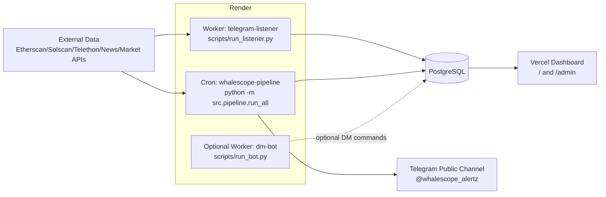

# WhaleScope Telegram 채널 중심 개선안 및 인스턴스 아키텍처

## 1. 결론

현재 문제는 `개인 DM 봇이 안 돌아서 채널 알림이 안 간다`가 아니다. 두 경로는 분리되어 있다.

- 공개 채널 발송: `Render Cron -> python -m src.pipeline.run_all -> broadcast_periodic / broadcast_daily -> TelegramBroadcastAdapter -> sendMessage`
- 개인 DM / 명령 수신: `Render Background Worker -> python scripts/run_bot.py -> getUpdates long polling`

따라서 앞으로의 개선 방향은 **DM 봇 복구 중심이 아니라 공개 채널을 1차 제품 표면으로 삼는 구조**가 맞다. 개인 DM 봇은 과제 데모에서 필수 가치가 낮고, 오히려 `getUpdates Conflict` 같은 운영 리스크를 만든다. 채널을 활성화하려면 파이프라인이 안정적으로 `보낼 만한 공개 메시지`를 만들고, 그 메시지를 채널에 발송하고, 운영 페이지에서 왜 보냈는지 또는 왜 안 보냈는지를 설명할 수 있어야 한다.

## 2. 현재 인스턴스 구조 판단

| 인스턴스 | 현재 역할 | 채널 활성화 관점 판단 |
|---|---|---|
| Render Cron `whalescope-pipeline` | `python -m src.pipeline.run_all` 15분 주기 실행. 수집, 브리핑, 스토리, 뉴스, 헬스체크, 채널 broadcast 실행 | **핵심 유지**. 채널 발송의 단일 진입점으로 둔다 |
| Render Background `run_listener.py` | Telethon으로 외부 고래 알림 채널을 수신해 `tg_whale_events` 저장 | **유지**. Bot API polling과 무관하며 데이터 원천 보강 역할 |
| Render Background `run_bot.py` | `/start`, `/watchlist`, `/pause`, `/status` 등 개인 DM 명령 수신 | **선택/후순위**. 채널 중심 운영에서는 중단 또는 단일 인스턴스로만 제한 |
| Vercel Dashboard | 유저 홈, 운영 페이지, 채널 CTA, 관측 화면 | **유지**. 채널 가입 유도와 운영 상태 설명의 표면 |
| PostgreSQL | 운영 데이터 저장소 | **유지**. Sheets 한도 이슈 이후 채널/운영 관측의 기준 원장 |

권장 운영 구조는 다음과 같다.



핵심 원칙:

1. 채널 발송은 반드시 `whalescope-pipeline` 하나만 담당한다.
2. `run_bot.py`는 채널 발송자가 아니다. DM 명령이 필요할 때만 단일 인스턴스로 켠다.
3. 채널 발송용 bot token은 가능하면 `TELEGRAM_BROADCAST_BOT_TOKEN`으로 분리한다.
4. 같은 `TELEGRAM_BOT_TOKEN`으로 long polling하는 인스턴스는 1개만 허용한다.

## 3. 현재 채널 미활성의 직접 원인

`broadcast_periodic`는 최근 15분 `signals`와 `transactions`를 조회한다.

```python
signal_rows = sheets.list_signals(since=window_start, limit=20)
transaction_rows = sheets.list_transactions(since=window_start, limit=50)

if not signal_rows and not transaction_rows:
    status = "skipped_empty"
    return result
```

최근 관측 결과:

- 최근 24시간 `broadcast_periodic` 27회 모두 `skipped_empty`
- 최신 transaction `created_at`이 약 26시간 이상 오래됨
- 최신 signal `created_at`이 약 58시간 이상 오래됨
- 최신 broadcast log는 `signals=0; transactions=0; recent_window=15m`

따라서 채널이 조용한 이유는 `sendMessage` 실패보다 앞단의 **메시지 후보 생성 실패**다.

주의할 점:

- 파이프라인 로그상 온체인 raw event 수집은 계속 발생할 수 있다.
- 하지만 DB에 신규 insert가 없거나 기존 transaction이 duplicate 처리되면 `created_at` 기준 최근 15분 조회에는 잡히지 않는다.
- 즉 현재 구조는 `새로 관측한 움직임`이 아니라 `새로 insert된 row`에 가까운 기준으로 채널 발송 대상을 고르고 있다.

## 4. 제품 방향: DM보다 채널을 우선해야 하는 이유

### 4.1 과제 데모 관점

공개 채널은 평가자가 가입하지 않아도 대시보드와 함께 이해하기 쉽다. 채널에 누적된 메시지는 `WhaleScope가 실제로 운영되는 서비스처럼 보이는 증거`가 된다. 반면 개인 DM은 평가자가 봇을 직접 시작하고 명령을 입력해야 가치가 드러난다.

### 4.2 운영 안정성 관점

채널 발송은 Telegram Bot API의 `sendMessage`만 쓰면 된다. 반면 개인 DM 봇은 `getUpdates` long polling을 사용하므로 같은 token을 쓰는 인스턴스가 2개만 떠도 `Conflict`가 발생한다. 채널 중심이 운영 리스크가 낮다.

### 4.3 UX 관점

WhaleScope의 핵심 가치는 `고래 움직임을 사람이 읽을 수 있는 시장 언어로 요약`하는 것이다. 이 가치는 공개 채널 타임라인에서 더 잘 보인다. 개인화 DM은 후속 확장 기능으로 두는 편이 자연스럽다.

## 5. 개선 목표

1. `@whalescope_alertz` 채널에 최소한 하루 1회 이상 의미 있는 공개 메시지가 게시된다.
2. 15분 주기 알림은 이벤트가 있을 때만 발송하되, 채널이 장시간 침묵하지 않도록 별도 `market pulse` 정책을 둔다.
3. `skipped_empty`가 발생해도 운영 페이지에서 `왜 비었는지`, `다음 발송 후보는 무엇인지`를 확인할 수 있다.
4. DM bot worker는 기본적으로 꺼도 전체 서비스 가치가 유지된다.
5. 채널 발송 bot token과 DM bot token을 분리할 수 있는 구조를 명시한다.

## 6. 개선안 A — 채널 발송 정책 재정의

### 6.1 메시지 종류

| 종류 | 주기 | 발송 조건 | 목적 |
|---|---:|---|---|
| `event_alert` | 15분 슬롯 | 최근 관측 고래 이동 또는 signal 존재 | 실시간성 |
| `market_pulse` | 1~2시간 | 이벤트가 없지만 채널 마지막 발송이 오래됨 | 채널 생존감, 시장 분위기 유지 |
| `daily_brief` | 매일 09:00 KST | 최신 daily brief 존재. 없으면 deterministic fallback | 하루 요약 |
| `weekly_trend` | 주 1회 | 주간 추세 데이터 존재 | 누적 분석 |
| `quiet_skip` | 매 15분 내부 상태 | 발송하지 않음. 운영 로그만 남김 | 노이즈 방지 |

### 6.2 발송 빈도 가드

- `event_alert`: 같은 내용 1시간 중복 금지 유지
- `market_pulse`: 최소 2시간 간격
- `daily_brief`: 하루 1회
- 전체 채널 메시지: 기본 상한 하루 12개
- 극단적 이벤트 즉시 발송은 후속 단계로 보류

### 6.3 empty slot 처리

현재는 empty slot이면 무조건 `skipped_empty`다. 개선 후에는 아래 순서로 판단한다.

```text
최근 15분 event/signal 존재?
├─ 예: event_alert 발송
└─ 아니오:
   ├─ 최신 daily_brief/news/market snapshot으로 market_pulse 생성 가능?
   │  ├─ 예 + 마지막 채널 발송이 2h 이상 전: market_pulse 발송
   │  └─ 예 + 너무 최근 발송: quiet_skip
   └─ 아니오: skipped_empty_but_explained
```

## 7. 개선안 B — `created_at` 의존 제거와 관측 기준 보강

현재 채널 발송 후보는 DB row의 `created_at`에 강하게 의존한다. duplicate가 많으면 파이프라인은 계속 수집해도 최근 발송 후보는 비어 보일 수 있다.

### 7.1 권장 데이터 모델

`transactions`에 아래 필드를 추가하거나 별도 `transaction_observations` 테이블을 둔다.

| 필드 | 의미 |
|---|---|
| `first_seen_at` | 최초 저장 시각 |
| `last_seen_at` | 가장 최근 파이프라인에서 다시 관측한 시각 |
| `seen_count` | 동일 transaction 관측 횟수 |
| `last_source` | 마지막 관측 source |
| `last_pipeline_run_id` | 마지막 관측 run |

### 7.2 저장 로직 변경

- 신규 transaction: insert + `first_seen_at=now`, `last_seen_at=now`
- 중복 transaction: skip만 하지 말고 `last_seen_at`, `seen_count` upsert
- `broadcast_periodic`: `created_at >= window_start`가 아니라 `last_seen_at >= window_start`도 후보로 인정

### 7.3 기대 효과

- 수집기는 정상인데 신규 insert가 없어서 채널이 침묵하는 문제 완화
- 운영 페이지에서 `새로운 거래`와 `최근 재관측 거래`를 분리 표시 가능
- 채널 메시지가 실제 관측 활동을 더 잘 반영

## 8. 개선안 C — Channel Message Planner 도입

`broadcast_periodic.py`에 조건문을 계속 늘리기보다, 채널 메시지 정책을 별도 planner로 분리한다.

### 8.1 신규 모듈 제안

```text
src/channel/message_planner.py
src/channel/message_formatter.py
src/channel/policy.py
```

### 8.2 주요 함수

```python
def plan_channel_message(context: ChannelContext) -> ChannelDecision:
    ...

def build_event_alert(decision: ChannelDecision) -> str:
    ...

def build_market_pulse(decision: ChannelDecision) -> str:
    ...
```

### 8.3 `ChannelDecision` 예시

```python
@dataclass
class ChannelDecision:
    decision: Literal[
        "send_event_alert",
        "send_market_pulse",
        "send_daily_brief",
        "skip_quiet",
        "skip_duplicate",
        "skip_unconfigured",
    ]
    reason: str
    message_kind: str
    candidate_signal_count: int
    candidate_transaction_count: int
    fallback_source: str
    next_expected_at: datetime | None
```

이 구조를 쓰면 운영 페이지에서 `왜 발송하지 않았는지`를 그대로 설명할 수 있다.

## 9. 개선안 D — 개인 DM 봇의 역할 축소

### 9.1 권장 기본값

Render에서는 당분간 `python scripts/run_bot.py` 인스턴스를 끄거나, 정확히 1개만 남긴다.

채널 중심 운영에서는 아래 기능만 유지하면 충분하다.

- 채널 CTA: Vercel 유저홈에서 `@whalescope_alertz` 열기, 링크 복사, QR
- 공개 채널 broadcast: pipeline cron에서 수행
- DM 명령: 선택 기능. 과제 핵심 경로에서는 제외

### 9.2 token 운영 원칙

가능하면 BotFather에서 broadcast 전용 bot을 하나 더 만들고 채널 admin으로 올린다.

```text
TELEGRAM_BROADCAST_BOT_TOKEN=<channel publisher bot token>
TELEGRAM_BROADCAST_CHAT=@whalescope_alertz
TELEGRAM_BROADCAST_ENABLED=true
TELEGRAM_BROADCAST_DRY_RUN=false
```

DM bot을 계속 쓸 경우:

```text
TELEGRAM_BOT_TOKEN=<dm command bot token>
```

운영 원칙:

- `TELEGRAM_BROADCAST_BOT_TOKEN`은 `sendMessage` 전용으로만 사용
- `TELEGRAM_BOT_TOKEN`은 `run_bot.py` long polling 전용으로만 사용
- 같은 token을 두 worker가 polling하지 않게 한다

현재 코드는 `TELEGRAM_BROADCAST_BOT_TOKEN`이 비어 있으면 `TELEGRAM_BOT_TOKEN`으로 fallback한다. 당장 동작에는 유리하지만, 운영 분리 관점에서는 production에서 broadcast token을 명시하는 것이 좋다.

## 10. 개선안 E — 운영 페이지 관측 강화

운영 페이지 `/admin`에는 아래 상태가 필요하다.

### 10.1 Channel Delivery 카드

| 지표 | 설명 |
|---|---|
| `last_channel_message_at` | 마지막 실제 채널 발송 시각 |
| `last_channel_status` | `sent`, `dry_run`, `skipped_empty`, `skipped_duplicate_content`, `failed` |
| `last_skip_reason` | 비발송 사유를 사람 언어로 표시 |
| `candidate_signal_count` | 최근 슬롯 signal 후보 수 |
| `candidate_transaction_count` | 최근 슬롯 transaction 후보 수 |
| `fallback_source` | market pulse 후보 원천: `daily_brief`, `news_feed`, `market_snapshot`, `none` |
| `next_expected_message_at` | 다음 메시지 예상 시각 |
| `publisher_token_source` | `broadcast_token`, `telegram_token_fallback`, `missing` |

### 10.2 인스턴스 상태 카드

| 인스턴스 | 표시 방식 |
|---|---|
| `whalescope-pipeline` | 마지막 run_all, 실패 job, 다음 due job |
| `telegram-listener` | 마지막 `tg_whale_events` / listener heartbeat |
| `dm-bot` | `active`, `paused_intentionally`, `conflict_detected`, `unknown` |
| `telegram-channel` | `channel_health.member_count`, bot admin 검증 결과 |

중요: DM bot을 끈 상태가 항상 장애는 아니다. 채널 중심 운영에서는 `paused_intentionally`를 정상 상태로 볼 수 있어야 한다.

## 11. 개선안 F — 채널 메시지 카피 정책

채널 메시지는 기술 로그가 아니라 사람이 읽는 브리핑이어야 한다.

### 11.1 `event_alert` 템플릿

```text
WhaleScope 고래 움직임 감지

최근 15분 동안 큰 이동 {n}건을 관측했습니다.
가장 큰 이동은 {asset} {amount_label}이며, 흐름은 {movement_label}로 분류됩니다.

핵심 관찰
- {summary_1}
- {summary_2}

주의: 이 알림은 투자 조언이 아니라 온체인/거래소 흐름 관측입니다.
```

### 11.2 `market_pulse` 템플릿

```text
WhaleScope 시장 관측 메모

최근 슬롯에서는 강한 고래 알림 조건은 없었습니다.
대신 현재 시장 분위기는 {mood_label} 쪽이며, 주요 뉴스/브리핑 기준으로는 {summary}가 관측됩니다.

다음 고래 이동이 감지되면 이 채널에 바로 정리해 드립니다.
```

### 11.3 LLM 사용 정책

- 이벤트 숫자, 금액, 방향은 LLM이 재작성하지 않는다.
- LLM은 `사람이 읽는 요약 문장`만 생성한다.
- LLM 예산 초과 시 deterministic formatter로 fallback한다.
- 모든 메시지 끝에는 투자 조언 아님 문구를 유지한다.

## 12. 구현 순서

### Phase 1 — 운영 인스턴스 정리

- [ ] Render에서 `python scripts/run_bot.py` 실행 서비스가 0개 또는 1개인지 확인
- [ ] 채널 중심 운영이면 DM bot worker를 중지하고 `/admin`에서 `paused_intentionally`로 표시
- [ ] `TELEGRAM_BROADCAST_BOT_TOKEN`을 production에 명시하거나, fallback 사용 여부를 운영 문서에 명확히 기록
- [ ] `TELEGRAM_BROADCAST_ENABLED=true`
- [ ] `TELEGRAM_BROADCAST_DRY_RUN=false`
- [ ] `TELEGRAM_BROADCAST_CHAT=@whalescope_alertz`

### Phase 2 — 채널 메시지 후보 생성 보강

- [ ] `broadcast_periodic`에 `market_pulse` fallback 정책 추가
- [ ] `daily_brief`, `news_feed`, `market snapshot`, `fear_greed`를 fallback 후보로 조회
- [ ] 마지막 실제 채널 발송이 2시간 이상 오래된 경우에만 `market_pulse` 허용
- [ ] `broadcast_log`에 `decision`, `reason`, `fallback_source`, `candidate_count`, `next_expected_at` 추가

### Phase 3 — transaction 관측 기준 보강

- [ ] `transactions`에 `last_seen_at`, `seen_count` 추가 또는 `transaction_observations` 테이블 추가
- [ ] duplicate transaction 처리 시 `last_seen_at` update
- [ ] `broadcast_periodic` 조회 기준에 `last_seen_at` 포함
- [ ] 운영 페이지에 `new_rows`와 `observed_rows`를 분리 표시

### Phase 4 — Channel Planner 분리

- [ ] `src/channel/message_planner.py` 추가
- [ ] `src/channel/message_formatter.py` 추가
- [ ] `broadcast_periodic.py`는 planner 호출과 adapter 호출만 담당하도록 축소
- [ ] `event_alert`, `market_pulse`, `quiet_skip` 단위 테스트 추가

### Phase 5 — 운영 페이지 관측 강화

- [ ] `/admin`에 Channel Delivery 카드 추가
- [ ] `/admin`에 인스턴스 상태 카드에서 DM bot `paused_intentionally` 상태 지원
- [ ] `skipped_empty`를 장애처럼만 보이지 않게 `보낼 후보 없음`, `fallback 후보 없음`, `rate guard` 등으로 세분화
- [ ] channel health와 broadcast log를 같은 섹션에서 연결

## 13. 테스트 계획

### 13.1 Python

```bash
pytest -q tests/test_broadcast_periodic.py tests/test_run_all.py tests/test_telegram_broadcast.py
```

추가해야 할 테스트:

- [ ] 최근 15분 signal/transaction이 있으면 `event_alert`
- [ ] signal/transaction이 없지만 마지막 발송이 2시간 이상 오래되고 daily brief가 있으면 `market_pulse`
- [ ] fallback 후보도 없으면 `skipped_empty`
- [ ] 같은 message hash는 1시간 중복 발송 금지
- [ ] `TELEGRAM_BROADCAST_ENABLED=false`면 `skipped_disabled`
- [ ] `TELEGRAM_BROADCAST_DRY_RUN=true`면 `dry_run`
- [ ] duplicate transaction이 `last_seen_at`을 갱신함

### 13.2 Dashboard

```bash
npm run dashboard:typecheck
npm run dashboard:lint
npm run dashboard:build
```

확인 항목:

- [ ] `/admin`에서 마지막 채널 발송 시각 확인
- [ ] `/admin`에서 `skipped_empty` 사유 확인
- [ ] `/admin`에서 DM bot이 꺼져 있어도 `장애`가 아니라 `paused_intentionally`로 보임
- [ ] 유저홈 Telegram CTA가 채널 중심으로 유지됨

### 13.3 운영 검증

- [ ] Render pipeline manual run 1회
- [ ] `broadcast_log` 최신 row 확인
- [ ] `system_log` 또는 service health에서 `broadcast_periodic` 상태 확인
- [ ] Telegram 채널에 실제 메시지 1건 도착 확인
- [ ] 이후 1시간 동안 중복 발송이 없는지 확인
- [ ] DM bot worker를 끈 경우 `getUpdates Conflict`가 사라지는지 확인

## 14. 리스크와 대응

| 리스크 | 대응 |
|---|---|
| 이벤트가 없어도 채널에 너무 자주 올라감 | `market_pulse` 최소 2시간 간격, 하루 총량 제한 |
| LLM이 수치를 왜곡 | 수치/방향은 deterministic formatter, LLM은 요약 문장만 |
| broadcast token과 DM token 혼동 | production env에서 `TELEGRAM_BROADCAST_BOT_TOKEN` 명시 |
| DM bot 중단을 장애로 오해 | `/admin`에 `paused_intentionally` 상태 추가 |
| duplicate 거래 때문에 채널 후보가 비어 보임 | `last_seen_at`/observation 기준 도입 |
| 채널 bot admin 권한 누락 | `channel_health`에 getChat/getChatMemberCount 및 send permission 검증 추가 |

## 15. 최종 권장안

이번 프로젝트는 과제 전형이므로 `개인 DM 봇`보다 `공개 채널이 살아 움직이는 모습`이 더 중요하다. 따라서 다음 결정을 권장한다.

1. `whalescope-pipeline` Render Cron은 유지하고, 채널 발송의 단일 진실 공급원으로 둔다.
2. `telegram-listener`는 데이터 원천 보강용으로 유지한다.
3. `run_bot.py` DM worker는 당분간 중지하거나 1개만 유지한다.
4. 채널 발송은 `TELEGRAM_BROADCAST_BOT_TOKEN` 기반으로 분리한다.
5. `broadcast_periodic`는 단순 `signals/transactions 없으면 skip`에서 `event_alert / market_pulse / quiet_skip` 정책으로 승격한다.
6. 운영 페이지는 `왜 안 보냈는지`를 설명하는 방향으로 강화한다.

이 구조가 적용되면 Telegram 메시지 미수신 문제는 `봇이 안 돈다`가 아니라 `현재 채널 발송 정책이 어떤 판단을 했는가`로 관측 가능해진다. 채널 중심 서비스로 보여주기에도 이 편이 더 명확하다.
