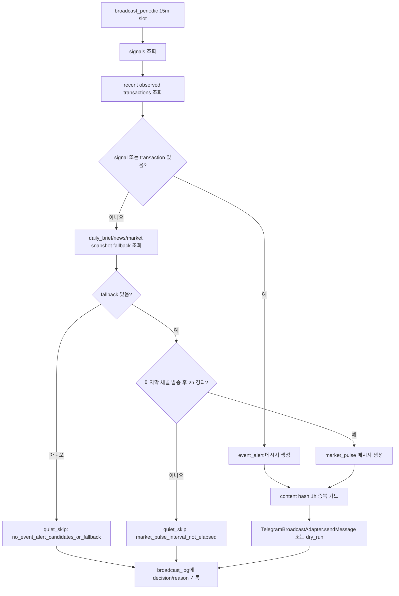

# WhaleScope Telegram 채널 중심 개선안 구현 및 QA 보고서

## 1. 구현 결론

`개인 DM 봇 복구`가 아니라 `공개 Telegram 채널 활성화`를 중심으로 개선했다. 채널 발송 경로는 계속 `Render Cron -> python -m src.pipeline.run_all -> broadcast_periodic / broadcast_daily -> TelegramBroadcastAdapter`로 유지하되, `broadcast_periodic`가 더 이상 단순히 최근 15분 signal/transaction이 없다는 이유만으로 채널을 완전히 침묵시키지 않도록 정책을 확장했다.

핵심 변경:

- `event_alert`, `market_pulse`, `quiet_skip`을 구분하는 channel planner를 추가했다.
- signal/transaction이 없더라도 daily brief/news/market snapshot fallback이 있고 최근 채널 발송 후 2시간 이상 지났으면 `market_pulse`를 발송할 수 있게 했다.
- transaction duplicate 관측 시 `last_seen_at`, `seen_count`를 갱신해 신규 insert가 없어도 최근 관측 후보를 만들 수 있게 했다.
- `broadcast_log`에 채널 발송 판단 metadata를 실제로 저장하도록 Sheets/Postgres 스키마를 확장했다.
- `/admin`에서 채널 발송 상태와 DM bot optional 상태를 분리해 볼 수 있게 했다.

## 2. 병렬 개발 트랙 결과

### Track A — Channel Message Planner

담당 범위:

- `src/channel/policy.py`
- `src/channel/message_planner.py`
- `src/channel/message_formatter.py`
- `src/pipeline/broadcast_periodic.py`
- `tests/test_channel_message_planner.py`
- `tests/test_broadcast_periodic.py`

구현 내용:

- `event_alert`: 최근 signal 또는 transaction 후보가 있으면 기존 periodic update 형식으로 발송.
- `market_pulse`: 이벤트 후보가 없지만 fallback 정보가 있고 최근 채널 발송 후 2시간 이상 지났으면 시장 관측 메모 발송.
- `quiet_skip`: 이벤트 후보와 fallback이 없거나 2시간 간격이 지나지 않았으면 발송하지 않고 사유를 기록.
- 기존 1시간 content hash 중복 발송 방지는 유지.
- `broadcast_periodic`는 `list_recent_observed_transactions()`가 있으면 우선 사용하고, 없으면 기존 `list_transactions()`로 fallback한다.

### Track B — Transaction Observation Storage

담당 범위:

- `src/storage/schema.py`
- `src/storage/postgres_schema.py`
- `src/storage/postgres_client.py`
- `src/storage/sheets_client.py`
- `src/storage/protocol.py`
- `scripts/init_postgres.py`
- `scripts/migrate_sheets_to_postgres.py`
- storage 관련 테스트

구현 내용:

- `transactions`에 `last_seen_at`, `seen_count` 추가.
- Postgres `append_transactions()`는 `raw_response_hash` 중복 시 insert count를 늘리지 않고 `last_seen_at`, `seen_count`를 갱신.
- Sheets legacy 경로도 중복 transaction row의 `last_seen_at`, `seen_count`를 갱신.
- `list_recent_observed_transactions(since, limit)` public method 추가.
- 기존 데이터베이스에 대한 idempotent migration 추가.

### Track C — Admin Observability

담당 범위:

- `apps/dashboard/lib/metrics.ts`
- `apps/dashboard/lib/types.ts`
- `apps/dashboard/app/admin/page.tsx`

구현 내용:

- `adminObservability.telegram`에 채널 발송 요약 필드 추가.
- 추가 필드:
  - `last_channel_message_at`
  - `last_channel_status`
  - `last_skip_reason`
  - `candidate_signal_count`
  - `candidate_transaction_count`
  - `fallback_source`
  - `next_expected_message_at`
  - `publisher_token_source`
- `/admin`에 Channel Delivery 카드와 Telegram 인스턴스 상태 카드를 추가.
- `run_bot.py` DM bot은 채널 중심 운영에서 `optional` 또는 `paused_intentionally`로 해석할 수 있게 copy를 조정.

## 3. 메인 통합 보강

서브에이전트 결과 통합 중 아래 연결 누락을 발견해 메인에서 보강했다.

1. A가 `broadcast_log`에 `decision`, `reason`, `fallback_source` 등을 넣었지만, storage schema가 아직 해당 컬럼을 저장하지 않았다.
2. C의 `/admin`은 해당 필드를 읽을 수 있게 되어 있었지만, 실제 DB/Sheets에 persist되지 않으면 추론값만 표시되는 상태였다.
3. B가 `list_recent_observed_transactions()`를 추가했지만 A의 `broadcast_periodic`가 아직 호출하지 않았다.

보강 내용:

- `BROADCAST_LOG_HEADERS`에 channel decision metadata 추가.
- Postgres `broadcast_log` DDL, migration, insert params 확장.
- Sheets `append_broadcast_log()` normalized row 확장.
- Sheets -> Postgres migration params 확장.
- `broadcast_periodic`가 `list_recent_observed_transactions()`를 우선 사용하도록 연결.

## 4. 현재 채널 발송 판단 흐름



## 5. QA 및 빌드 검증

### Python targeted

```bash
pytest -q tests/test_channel_message_planner.py tests/test_broadcast_periodic.py tests/test_postgres_client.py tests/test_storage.py tests/test_storage_new_tabs.py
```

결과:

```text
112 passed, 1 skipped in 33.32s
```

### Python compile

```bash
python -m py_compile src/channel/message_planner.py src/channel/message_formatter.py src/channel/policy.py src/pipeline/broadcast_periodic.py src/storage/postgres_client.py src/storage/sheets_client.py src/storage/postgres_schema.py scripts/init_postgres.py scripts/migrate_sheets_to_postgres.py
```

결과: 통과.

### Dashboard typecheck/lint/build

```bash
npm run dashboard:typecheck
npm run dashboard:lint
npm run dashboard:build
```

결과: 모두 통과.

### Dashboard E2E

```bash
npm run dashboard:e2e
```

결과:

```text
20 passed
```

### 전체 Python 회귀

```bash
pytest -q
```

결과:

```text
493 passed, 5 skipped, 6 warnings in 40.86s
```

warning은 기존 Telegram/Pydantic/protobuf deprecation 계열이며 이번 변경으로 인한 실패는 아니다.

## 6. 운영 적용 절차

Render/Postgres 운영 반영 시 필요한 절차:

1. 최신 `main` 배포 후 Render pipeline service에서 schema init을 1회 실행한다.
   - 명령: `python -m scripts.init_postgres`
   - 목적: `transactions.last_seen_at`, `transactions.seen_count`, `broadcast_log.decision` 등 신규 컬럼 추가.
2. Render pipeline cron은 기존처럼 유지한다.
   - 명령: `python -m src.pipeline.run_all`
3. 채널 중심 운영 env를 확인한다.
   - `TELEGRAM_BROADCAST_CHAT=@whalescope_alertz`
   - `TELEGRAM_BROADCAST_ENABLED=true`
   - `TELEGRAM_BROADCAST_DRY_RUN=false`
   - 권장: `TELEGRAM_BROADCAST_BOT_TOKEN`을 별도 publisher token으로 설정
4. DM bot worker는 선택 기능으로 둔다.
   - 계속 쓸 경우 `python scripts/run_bot.py` 인스턴스는 정확히 1개만 유지.
   - 채널 중심 데모가 우선이면 중지해도 된다.
5. `/admin`에서 Channel Delivery 카드 확인.
   - `last_channel_status`
   - `last_skip_reason`
   - `candidate_signal_count`
   - `candidate_transaction_count`
   - `fallback_source`
   - `publisher_token_source`

## 7. 남은 운영 확인

- [ ] Render production Postgres에 신규 migration 실제 적용.
- [ ] 다음 15분 cron 후 `broadcast_log`에 `decision`, `reason`, `fallback_source`가 저장되는지 확인.
- [ ] signal/transaction 후보가 없는 슬롯에서 `market_pulse` 또는 `quiet_skip`이 의도대로 분기되는지 확인.
- [ ] `@whalescope_alertz` 채널에 실제 메시지가 1건 이상 발송되는지 확인.
- [ ] DM bot worker를 중지할 경우 `/admin`에서 optional/paused 의미로 보이는지 확인.

## 8. 워크트리 주의사항

작업 전부터 존재하던 `apps/dashboard/app/about/about.css` 변경은 이번 작업 범위가 아니므로 건드리지 않았다. 최종 커밋 시에도 해당 파일은 제외해야 한다.

